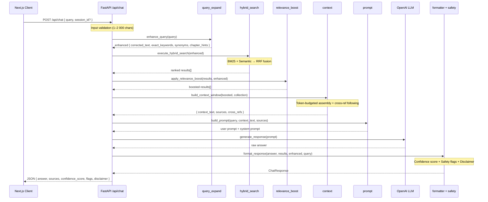
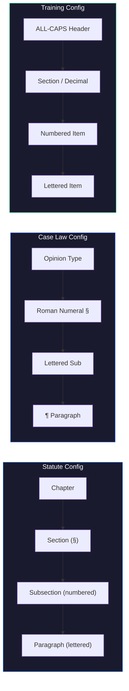

# System Architecture

## Table of Contents

- [Overview](#overview)
- [RAG Pipeline Diagram](#rag-pipeline-diagram)
- [Pipeline Stage Details](#pipeline-stage-details)
- [Design Decisions](#design-decisions)
- [Scalability Considerations](#scalability-considerations)
- [Security and Privacy Measures](#security-and-privacy-measures)
- [Implementation Details](#implementation-details)
- [Performance Characteristics](#performance-characteristics)
- [Quality Assurance](#quality-assurance)

---

## Overview

This system is a Retrieval-Augmented Generation (RAG) application purpose-built for Wisconsin law enforcement officers. It allows officers to query state statutes, case law, and department policies through a conversational chat interface. The backend is a FastAPI service backed by ChromaDB (vector store) and OpenAI (embeddings + LLM), served to a Next.js frontend.

The architecture follows three clearly separated stages: **Ingestion** (offline, one-time), **Retrieval** (per-query), and **Generation** (per-query).

---

## RAG Pipeline Diagram

### End-to-End Data Flow

```mermaid
flowchart TB
    subgraph INGESTION ["① Ingestion (Offline)"]
        direction TB
        PDF["PDF / DOCX / HTML<br/>Documents"]
        PARSE["parse_file()<br/><i>pdfplumber · python-docx · BeautifulSoup</i>"]
        NORM["normalize_text()<br/><i>Strip headers/footers · Collapse whitespace</i>"]
        CHUNK["chunk_document()<br/><i>Doc-type-aware hierarchical chunking</i>"]
        META["extract_metadata()<br/><i>Statute numbers · Case citations · Jurisdiction</i>"]
        EMBED["generate_embeddings()<br/><i>OpenAI text-embedding-3-small</i>"]
        UPSERT["batch_upsert()<br/><i>ChromaDB persistent store</i>"]

        PDF --> PARSE --> NORM --> CHUNK --> META --> EMBED --> UPSERT
    end

    subgraph RETRIEVAL ["② Retrieval (Per-Query)"]
        direction TB
        QUERY["User Query"]
        ENHANCE["enhance_query()<br/><i>Abbreviation expansion · Synonym mapping<br/>Statute/citation extraction · Chapter hints</i>"]
        HYBRID["execute_hybrid_search()<br/><i>BM25 keyword + ChromaDB semantic</i>"]
        RRF["Reciprocal Rank Fusion<br/><i>k = 60</i>"]
        BOOST["apply_relevance_boost()<br/><i>Source-type · Jurisdiction · Exact match multipliers</i>"]
        CTX["build_context_window()<br/><i>Token-budgeted (4 000 tokens)<br/>Cross-reference following</i>"]

        QUERY --> ENHANCE --> HYBRID --> RRF --> BOOST --> CTX
    end

    subgraph GENERATION ["③ Generation (Per-Query)"]
        direction TB
        PROMPT["build_prompt()<br/><i>System prompt + Context + Sources + Question</i>"]
        LLM["generate_response()<br/><i>OpenAI GPT-3.5-Turbo</i>"]
        SAFETY["build_safety_addendum()<br/><i>Use-of-force · Outdated · Jurisdiction flags</i>"]
        FORMAT["format_response()<br/><i>Confidence score · Citations · Disclaimer</i>"]

        PROMPT --> LLM --> SAFETY --> FORMAT
    end

    subgraph FRONTEND ["④ Frontend (Next.js)"]
        direction TB
        UI["Chat Interface<br/><i>AppShell · ChatStream · MessageBubble</i>"]
        CITE["CitationCard · ConfidenceBadge · FlagBanner"]
        PANEL["SourcePanel<br/><i>Full source detail view</i>"]
    end

    UPSERT -.->|"ChromaDB<br/>Vector Store"| HYBRID
    CTX --> PROMPT
    FORMAT -->|"JSON Response"| UI
    UI --> CITE --> PANEL

    style INGESTION fill:#1a1a2e,stroke:#005cde,color:#fff
    style RETRIEVAL fill:#1a1a2e,stroke:#2563eb,color:#fff
    style GENERATION fill:#1a1a2e,stroke:#00B96B,color:#fff
    style FRONTEND fill:#1a1a2e,stroke:#F4801A,color:#fff
```



### Request Lifecycle (API Layer)



### Document-Type-Aware Chunking Hierarchy



---

## Pipeline Stage Details

### Stage 1 — Ingestion (`backend/ingestion/`)

Ingestion is a one-time offline process that transforms raw legal documents into searchable vector embeddings.

| Step          | Module          | Function             | Description                                                                                                                                                                                                                                                                                                                                                   |
| ------------- | --------------- | -------------------- | ------------------------------------------------------------------------------------------------------------------------------------------------------------------------------------------------------------------------------------------------------------------------------------------------------------------------------------------------------------- |
| Parse         | `parser.py`     | `parse_file()`       | Dispatches by file extension: **pdfplumber** for PDFs (page-by-page), **python-docx** for DOCX, **BeautifulSoup** for HTML. Produces `ParsedDocument` dataclass with pages, full text, and subfolder classification.                                                                                                                                          |
| Normalize     | `normalizer.py` | `normalize_text()`   | Two-stage pipeline: `strip_headers_footers()` removes page numbers, copyright lines, and date headers via regex patterns; `normalize_whitespace()` collapses excessive spacing. Preserves all legal markers (Chapter, §, Section).                                                                                                                            |
| Chunk         | `chunking.py`   | `chunk_document()`   | **Document-type-aware hierarchical chunking** with three configs (`STATUTE_CONFIG`, `CASE_LAW_CONFIG`, `TRAINING_CONFIG`). Detects hierarchy via regex patterns, builds context breadcrumbs (e.g. `Chapter 943 > § 940.01 > (2) > (a)`), splits at legal boundaries with ~1 000-token targets and 15% overlap. Token counting via **tiktoken** `cl100k_base`. |
| Metadata      | `metadata.py`   | `extract_metadata()` | Extracts statute numbers (`§ X.XX`), case citations (`2023 WI App X`), chapter numbers; infers source type and jurisdiction; generates **deterministic doc IDs** via SHA-256 for idempotent re-ingestion.                                                                                                                                                     |
| Embed & Store | `ingest.py`     | `run_ingestion()`    | Generates embeddings via OpenAI (`text-embedding-3-small`), batched upserts to ChromaDB (default batch size 100). Embedding text = `context_header + content` for richer semantic signal.                                                                                                                                                                     |

### Stage 2 — Retrieval (`backend/retrieval/`)

Retrieval runs on every user query and produces a ranked, token-budgeted context window.

| Step             | Module               | Function                    | Description                                                                                                                                                                                                                              |
| ---------------- | -------------------- | --------------------------- | ---------------------------------------------------------------------------------------------------------------------------------------------------------------------------------------------------------------------------------------- |
| Query Expansion  | `query_expand.py`    | `enhance_query()`           | Expands law enforcement abbreviations (35 mappings in `abbreviations.py`), maps colloquialisms to legal terms (34 mappings in `legal_terms.py`), extracts exact statute numbers and case citations, resolves chapter hints.              |
| Hybrid Search    | `hybrid_search.py`   | `execute_hybrid_search()`   | Runs **two parallel searches**: semantic (ChromaDB cosine similarity on query embedding) and keyword (**BM25Okapi** on tokenized corpus). Results merged via **Reciprocal Rank Fusion** (k=60).                                          |
| Relevance Boost  | `relevnace_boost.py` | `apply_relevance_boost()`   | Applies multiplicative score adjustments: superseded documents dropped (×0.0), policy queries with local department sources boosted (×1.5), state jurisdiction (×1.2), exact statute match (×1.3), chapter hint match (×1.15).           |
| Cross-References | `cross_ref.py`       | `detect_cross_references()` | Parses cross-reference language ("see also §", "pursuant to §", "§ X applies", "Chapter X") to extract cited statute/chapter numbers.                                                                                                    |
| Context Assembly | `context.py`         | `build_context_window()`    | Iterates ranked chunks within a **4 000-token budget**, appending each chunk and following its cross-references if budget permits. Deduplicates chunks by ID. Returns assembled context text, source list, and cross-reference tracking. |

### Stage 3 — Generation (`backend/generation/`)

Generation transforms the retrieved context into a coherent, safe natural-language response.

| Step         | Module         | Function                  | Description                                                                                                                                                                                                                                                                                                                          |
| ------------ | -------------- | ------------------------- | ------------------------------------------------------------------------------------------------------------------------------------------------------------------------------------------------------------------------------------------------------------------------------------------------------------------------------------ |
| Prompt Build | `prompt.py`    | `build_prompt()`          | Constructs the user prompt by injecting numbered context chunks, source list, and the original question. The **system prompt** defines the assistant's role as a Wisconsin law enforcement legal information assistant with strict rules: no inline citation brackets, no fabrication, acknowledge contradictions, clean prose only. |
| LLM Call     | `llm.py`       | `generate_response()`     | Calls OpenAI Chat Completions via a **lazy singleton client**. Configurable model (`gpt-3.5-turbo` default), temperature (`0.3`), and max tokens.                                                                                                                                                                                    |
| Safety       | `safety.py`    | `build_safety_addendum()` | Three independent checks: **use-of-force detection** (17 trigger terms like "deadly force", "taser", "vehicle pursuit"), **outdated source flagging** (>10 years based on filename year), **jurisdiction mismatch** (general query returning local results). Produces flags and addendum text.                                       |
| Format       | `formatter.py` | `format_response()`       | Assembles the final response: raw LLM text + **algorithmic confidence score** (0.0–1.0) + safety flags + top 3 sources + mandatory legal disclaimer.                                                                                                                                                                                 |

### API Layer (`backend/api/`)

| Endpoint      | Method | Description                                                                                                                     |
| ------------- | ------ | ------------------------------------------------------------------------------------------------------------------------------- |
| `/api/chat`   | POST   | Full RAG pipeline — query expansion through formatted response. Sync pipeline stages run in thread pool via `asyncio` executor. |
| `/api/search` | POST   | Retrieval-only (no LLM) — returns raw ranked chunks for debugging.                                                              |
| `/api/health` | GET    | ChromaDB connectivity check + collection document count.                                                                        |

### Frontend (`frontend/src/`)

| Layer      | Key Modules                                                                                   | Description                                                                                                                                                                |
| ---------- | --------------------------------------------------------------------------------------------- | -------------------------------------------------------------------------------------------------------------------------------------------------------------------------- |
| State      | `chatStore.ts`, `uiStore.ts`                                                                  | **Zustand** stores. Chat store manages conversations, messages, CRUD with localStorage persistence and debounced writes. UI store tracks sidebar/panel/field-mode state.   |
| API        | `api.ts`                                                                                      | Typed `request<T>()` wrapper with `APIError` class. Endpoints: `chat`, `search`, `health`.                                                                                 |
| Components | `ChatStream`, `MessageBubble`, `CitationCard`, `ConfidenceBadge`, `FlagBanner`, `SourcePanel` | Message rendering with confidence badges (high/medium/low), safety flag banners, clickable citation cards with keyword highlighting, responsive source panel.              |
| Layout     | `AppShell`, `Sidebar`, `BottomSheet`                                                          | Three-column responsive layout: Sidebar (conversation list grouped by date, health indicator) · Main chat area · Source panel (desktop: side panel, mobile: bottom sheet). |
| Hooks      | `useChat`, `useHealth`, `useMediaQuery`, `useScrollToBottom`                                  | Chat message sending with error handling, health polling, responsive breakpoints, auto-scroll.                                                                             |

---

## Design Decisions

### 1. ChromaDB as Vector Store

**Decision**: Use ChromaDB with persistent local storage and cosine distance metric.

**Rationale**: ChromaDB requires zero external infrastructure, no separate database server, no cloud service dependency. For an internal law enforcement tool that may run on-premises in a secure environment, this is critical. The persistent client stores data to disk at `chroma_db/`, surviving restarts. Cosine distance is the standard similarity metric for normalized embeddings and aligns well with OpenAI's `text-embedding-3-small` output.

**Trade-off**: ChromaDB scales to ~1M vectors on a single node. For a Wisconsin statute/case law corpus (hundreds to low thousands of chunks), this provides ample headroom. If the corpus grew to millions of documents, we'd migrate to a managed solution (Pinecone, Weaviate, etc.) without changing the retrieval interface.

### 2. Hybrid Search with Reciprocal Rank Fusion

**Decision**: Combine BM25 keyword search with ChromaDB semantic search, merged via Reciprocal Rank Fusion (RRF, k=60).

**Rationale**: Legal queries often mix **exact references** ("§ 346.63") with **conceptual questions** ("when can an officer use deadly force?"). Pure semantic search misses exact statute number matches; pure keyword search misses conceptual similarity. BM25 excels at the former, embeddings at the latter. RRF is a parameter-light fusion strategy — the single constant `k=60` avoids the need to tune relative weights between the two systems.

**Formula**: For each document, `RRF_score = Σ 1/(k + rank_i)` across both ranked lists. This naturally promotes documents that rank well in both systems.

### 3. Document-Type-Aware Hierarchical Chunking

**Decision**: Maintain three separate `DocTypeConfig` schemas (statute, case law, training) with different hierarchy patterns, regex detection, and content-based fallback.

**Rationale**: Wisconsin statutes follow a Chapter → Section (§) → Subsection → Paragraph structure. Case law uses Opinion Type → Roman-numeral sections → ¶ paragraph markers. Training documents use ALL-CAPS headers → Sections → Numbered items. A one-size-fits-all chunker would either miss critical section boundaries or create semantically incoherent chunks. The `_detect_doc_type_from_content()` fallback ensures correct chunking even when files are misplaced.

**Context breadcrumbs** (e.g. `Chapter 943 > § 943.20 > (1) > (a)`) are prepended to each chunk's embedding text, giving the vector a richer semantic signal that captures hierarchy position.

### 4. Deterministic Document IDs via SHA-256

**Decision**: Generate chunk IDs as `SHA-256(source_file + chunk_index + first_200_chars)`, truncated to 32 hex characters.

**Rationale**: Makes re-ingestion **idempotent**. Running the ingestion pipeline twice on the same documents produces the same IDs, so ChromaDB upserts overwrite rather than duplicate. This is essential for a system where statutes may be periodically re-parsed after PDF updates.

### 5. Token-Budgeted Context Window with Cross-Reference Following

**Decision**: Assemble context by iterating ranked chunks in order within a 4 000-token budget, following cross-references when budget permits.

**Rationale**: LLM context windows have hard limits and costs scale with input tokens. A fixed token budget (configurable via `CHUNK_TARGET_TOKENS`) prevents runaway costs while maximizing information density. Cross-reference following (e.g. "see also § 940.01") enriches the context with related statutes without exceeding the budget — if a referenced chunk doesn't fit, it's silently skipped.

### 6. Algorithmic Confidence Scoring (No Extra LLM Call)

**Decision**: Compute confidence as a weighted sum of four retrieval-quality signals rather than asking the LLM to self-assess.

**Formula** (computed in `formatter.py`):

| Component          | Weight | Signal                                                  |
| ------------------ | ------ | ------------------------------------------------------- |
| Base               | 0.20   | Constant floor                                          |
| Topic relevance    | 0.25   | Exact keyword or synonym match in top-3 results         |
| RRF score strength | 0.30   | Normalized top result score (higher = better retrieval) |
| Score variance     | 0.10   | High variance in top-5 = dominant relevant result       |
| Source diversity   | 0.30   | Distinct source files in top-5 (0.10 each, capped)      |

**Rationale**: LLM self-assessment is unreliable and adds latency + cost. These four signals are computable from retrieval results alone and correlate with answer quality: strong retrieval with diverse corroborating sources → high confidence; weak retrieval with scattered results → low confidence.

### 7. Safety Guardrails

**Decision**: Three independent safety checks run on every response:

1. **Use-of-force detection**: 17 trigger terms (e.g. "deadly force", "taser", "vehicle pursuit") flag responses with `USE_OF_FORCE_CAUTION` and append a department-policy caveat.
2. **Outdated source detection**: Extracts year from source filenames; flags `OUTDATED_POSSIBLE` if any source is >10 years old.
3. **Jurisdiction mismatch**: Flags `JURISDICTION_NOTE` when a general query returns local department results.

**Rationale**: Law enforcement officers may act on information from this system. Use-of-force policies vary by department and have life-or-death consequences — a generic answer could be dangerous. Outdated statutes may have been amended. Local policies don't apply statewide. These guardrails ensure the officer sees appropriate caveats.

---

## Scalability Considerations

### Current Architecture Capacity

The system is designed for a single-server deployment serving a law enforcement department or small consortium. Current capacity estimates:

| Dimension            | Current Limit   | Bottleneck                           |
| -------------------- | --------------- | ------------------------------------ |
| Corpus size          | ~1M chunks      | ChromaDB single-node limit           |
| Concurrent queries   | ~50–100         | Thread pool size for sync operations |
| Query latency        | < 3s end-to-end | LLM API call (~1–2s typical)         |
| Embedding throughput | ~100 docs/batch | OpenAI API rate limits               |

### Scaling Strategies

#### Backend:

- Deploy more FastAPI server instances behind a load balancer
- Currently stateless so API can be load-balanced easily across multiple insances behind a reverse proxy like nginx

#### Vector Store:

- Migrate to cloud storage
- You can shard by jurisdiction and document type

#### Async + Thread Pool Offloading

All API endpoints are `async def`. CPU-bound pipeline stages (query expansion, relevance boosting, context assembly) are offloaded to a thread pool executor via `asyncio.get_event_loop().run_in_executor()` in the `_run_sync()` helper. This prevents blocking the event loop during computation-heavy steps and allows the server to continue accepting requests.

#### BM25 Index Caching

The BM25 index is created one time from all the documents in ChromaDB and then reused. When documents are added or updated, `invalidate_bm25_cache()` clears the old index so it can be rebuilt. This saves a lot of work because rebuilding the BM25 index means processing every document, which gets slower as the dataset grows.

#### Batch Embedding Upserts

Ingestion batches embedding requests and ChromaDB upserts in groups of `EMBEDDING_BATCH_SIZE` (default 100). This minimizes OpenAI API round-trips and ChromaDB write transactions.

#### Token Budget Controls

The configurable token budget (`CHUNK_TARGET_TOKENS` for chunking, 4 000-token context window for retrieval) prevents unbounded LLM input. This controls both cost (OpenAI charges per token) and latency (larger context = slower generation).

#### Configurable Parameters

All performance-critical parameters are exposed via environment variables through `pydantic_settings`:

| Parameter                | Default                | Effect                                              |
| ------------------------ | ---------------------- | --------------------------------------------------- |
| `CHUNK_TARGET_TOKENS`    | 1 000                  | Larger chunks = fewer vectors, less granularity     |
| `CHUNK_OVERLAP_FRACTION` | 0.15                   | Overlap between adjacent chunks for continuity      |
| `EMBEDDING_BATCH_SIZE`   | 100                    | Embedding API batch size                            |
| `LLM_MODEL`              | gpt-3.5-turbo          | Can upgrade to gpt-4 for quality at cost of latency |
| `LLM_TEMPERATURE`        | 0.3                    | Lower = more deterministic responses                |
| `EMBEDDING_MODEL`        | text-embedding-3-small | Can upgrade to text-embedding-3-large for quality   |

---

## Security and Privacy Measures

### Input Validation

- **Query length**: Enforced at 1–2 000 characters via Pydantic `Field(min_length=1, max_length=2000)` in `ChatRequest`. Rejects empty and excessively long inputs before any processing.
- **Type validation**: All request/response models use Pydantic v2 strict typing with field validators that coerce `None` to empty strings, preventing null-propagation errors.

### Network Security

- **CORS**: `CORSMiddleware` restricts cross-origin requests to `CORS_ORIGINS` (configured in `.env`, default: `http://localhost:3000`). Only the expected frontend origin can call the API.
- **No authentication layer**: The system is designed for deployment on an **internal law enforcement network** behind existing network-level access controls (VPN, firewall). Adding JWT/OAuth is straightforward if external access is needed.

### Request Logging

- Every request is logged with method, path, status code, and elapsed time via the `logging_middleware` in `middleware.py`.
- **No PII logging**: Query content and response bodies are not written to logs.

### LLM Safety

- **System prompt guardrails** (`prompt.py`): The system prompt explicitly instructs the LLM to never fabricate statutes or citations not present in the provided context, acknowledge contradictions between sources, and produce clean prose without code fences or JSON.
- **Mandatory disclaimer** (`formatter.py`): Every response includes: _"This system provides legal information, not formal legal advice. Always verify with current statutes."_
- **Use-of-force caution** (`safety.py`): 17 trigger terms (including "deadly force", "taser", "chokehold", "vehicle pursuit", "no-knock", "lethal") automatically flag responses with `USE_OF_FORCE_CAUTION` and append a caveat that department-specific policies supersede general information.
- **Outdated source flagging**: Sources with file-year >10 years old trigger `OUTDATED_POSSIBLE` flags.
- **Jurisdiction mismatch**: General queries returning local department results trigger `JURISDICTION_NOTE` flags.

### Data Protection

- **API keys**: The `OPENAI_API_KEY` is stored in `.env` (git-ignored) and loaded via `pydantic_settings.BaseSettings`. Never hardcoded, never logged. (Should rotate keys regularly and have sperate keys for prod and dev for best practices)
- **Local data storage**: All legal documents and the ChromaDB vector store reside on the local filesystem. No data is sent to external services except the OpenAI API (query text + context chunks for embedding/generation).
- **Deterministic IDs**: Document chunk IDs are SHA-256 hashes the ID itself does not leak document content.

### Operational Safety

- **Health endpoint** (`/api/health`): Provides ChromaDB connectivity and document count checks for monitoring without exposing sensitive data.
- **Error handling**: API routes catch exceptions and return structured error responses. Internal errors do not leak stack traces to clients.
- **Thread pool isolation**: Sync pipeline stages run in a separate thread pool, preventing a slow LLM call from starving the event loop and blocking health checks or other requests.

### Production Considerations

#### 1. Authentication

- Implment user auth
- Role based access

#### 2. Logging

- Monitor activity and unusual patterns
- Log queries and responses
- Log document access

#### 3. Rate limiting

- Implment user rate limit to prevent DDOS attacks

### Data Flow Boundary

The following diagram shows what data crosses the network boundary:

```
┌─────────────────────────────────────────────────────────────┐
│  Internal Network (Law Enforcement)                         │
│                                                             │
│  ┌──────────┐     ┌──────────┐     ┌───────────────────┐    │
│  │ Browser  │────▶│ FastAPI  │────▶│ ChromaDB (local)  │    │
│  │ (Next.js)│◀────│ Backend  │◀────│ Vector Store      │    │
│  └──────────┘     └────┬─────┘     └───────────────────┘    │
│                        │                                    │
│                        │ Legal Documents                    │
│                        │ (data/ directory)                  │
│                        │                                    │
└────────────────────────┼────────────────────────────────────┘
                         │
                         │ HTTPS (TLS 1.2+)
                         │ ┌─────────────────────────────┐
                         │ │ Data sent to OpenAI API:    │
                         │ │ • Query text + context      │
                         │ │   chunks (generation)       │
                         │ │ • Chunk text (embedding)    │
                         │ │                             │
                         │ │ NOT sent:                   │
                         │ │ • Full documents            │
                         │ │ • User identifiers          │
                         │ │ • Session data              │
                         │ │ • Conversation history      │
                         ▼ └─────────────────────────────┘
                    ┌──────────┐
                    │ OpenAI   │
                    │ API      │
                    └──────────┘
```

### On-Premises Deployment Considerations

For law enforcement environments with strict data sovereignty requirements:

- **No cloud dependency for storage**: ChromaDB runs as an embedded process, no external database connections. All document data and vector embeddings remain on the deployment server's filesystem.
- **Single external dependency**: Only the OpenAI API requires network egress. For fully air-gapped environments, swap `llm.py` to use a local model (e.g., Ollama, vLLM) by changing the `OpenAI` client's `base_url`.
- **Stateless API**: No server-side session storage. Conversation history lives in the browser's `localStorage`, never touching the server.

---

## Implementation Details

### Confidence Scoring Algorithm

Confidence is computed from retrieval signals alone — no extra LLM call. The algorithm in `formatter.py:compute_response_metadata()` sums four components:

```
confidence = base + topic_relevance + rrf_strength + score_variance + source_diversity
```

| Component          | Max Weight | Signal                                                                                   |
| ------------------ | ---------- | ---------------------------------------------------------------------------------------- |
| Base               | 0.20       | Constant floor — ensures a minimum score for any response                                |
| Topic relevance    | 0.25       | Exact keyword match (statute/citation) or synonym match in top-3 results                 |
| RRF score strength | 0.30       | Top result's RRF score normalized against theoretical max (rank-1 in both lists ≈ 0.033) |
| Score variance     | 0.10       | High variance in top-5 scores indicates a dominant relevant result                       |
| Source diversity   | 0.30       | +0.10 per distinct source file in top-5, capped at 0.30                                  |

**Worked example** — query "§ 940.01 homicide":

- Base: 0.20
- Topic relevance: +0.25 (exact statute `940.01` found in top result's `statute_numbers`)
- RRF strength: top score 0.033 → normalized = 0.033/0.033 = 1.0 → +0.30
- Score variance: high variance in top-5 → +0.08
- Source diversity: 3 distinct files → +0.10 × 3 = 0.30 (capped)
- **Total: min(0.20 + 0.25 + 0.30 + 0.08 + 0.30, 1.0) = 1.0** → clamped to 1.0

Final score clamped to [0.0, 1.0], rounded to 3 decimal places. `LOW_CONFIDENCE` flag triggers when confidence < 0.6.

### Relevance Boost Multipliers

After RRF fusion, `relevnace_boost.py` applies multiplicative score adjustments. Multipliers stack:

| Condition                                      | Multiplier | Rationale                                                           |
| ---------------------------------------------- | ---------- | ------------------------------------------------------------------- |
| `superseded == True`                           | ×0.0       | Hard drop — outdated statute versions are removed entirely          |
| Policy query + `local_department` jurisdiction | ×1.5       | Department-specific policies are most relevant for policy questions |
| `state` jurisdiction                           | ×1.2       | State-level sources are generally authoritative                     |
| Exact statute number match                     | ×1.3       | Precise statute reference in query matches chunk metadata           |
| Chapter hint match                             | ×1.15      | Topic-inferred chapter number matches chunk metadata                |

**Stacking example**: A state-jurisdiction chunk (×1.2) with an exact statute match (×1.3) gets a combined multiplier of 1.2 × 1.3 = **1.56×**.

### Cross-Reference Following

The context window builder (`context.py`) automatically follows citation chains within the token budget:

1. For each chunk added to the context (in rank order):
   - Scan text for cross-reference patterns: `"see also § X"`, `"pursuant to § X"`, `"§ X applies"`, `"Chapter N"`
   - For each detected reference, query ChromaDB for chunks matching the cited statute/chapter
   - Add cited chunks to the context if they fit within the remaining token budget
2. Deduplication by chunk ID prevents the same chunk from appearing twice
3. The algorithm is greedy — if one cited chunk exceeds the budget, it skips to the next rather than terminating

This enriches context with related statutes that the user didn't explicitly ask about but that the primary sources reference.

### BM25 Index Lifecycle

The BM25 keyword index in `hybrid_search.py` follows a lazy-initialization pattern:

1. **First query**: `_build_bm25_index()` fetches all documents from ChromaDB, tokenizes them with whitespace splitting, and builds a `BM25Okapi` instance. Cached in module-level globals.
2. **Subsequent queries**: Reuse the cached index (O(1) lookup vs O(n) rebuild).
3. **After re-ingestion**: Call `invalidate_bm25_cache()` to clear the globals, forcing a rebuild on the next query.
4. **Thread safety**: The GIL protects the global variable writes. Read-after-write is safe for concurrent async handlers.

---

## Performance Characteristics

### Per-Stage Latency Breakdown

Measured across 12 golden queries (mean values):

```
Query Enhancement     ████ 0.2 ms        (regex matching, dictionary lookups)
Hybrid Search         ████████████████████████████████████ 666 ms  (OpenAI embedding + ChromaDB + BM25)
Relevance Boosting    ██ 0.0 ms          (score multiplication, re-sort)
Context Assembly      ████ 5 ms          (token counting, cross-ref fetching)
Prompt Construction   ██ 0.0 ms          (string formatting)
LLM Generation        ████████████████████████████████████████████████ 1888 ms  (OpenAI API call)
Response Formatting   ██ 0.4 ms          (confidence scoring, safety checks)
────────────────────────────────────────────────────────────────────
Total                                     ~2559 ms
```

**Where time is spent**: ~74% of end-to-end latency is the LLM generation call. ~26% is hybrid search (dominated by the OpenAI embedding API call for the query vector). All other stages combined account for <1%.

### Optimization Strategies

| Strategy                 | Stage                  | Impact                                                                      |
| ------------------------ | ---------------------- | --------------------------------------------------------------------------- |
| BM25 index caching       | Hybrid Search          | Avoids O(n) corpus tokenization on every query                              |
| Singleton OpenAI client  | Embedding + Generation | Reuses HTTP connection pool, avoids session overhead                        |
| Thread pool offloading   | All sync stages        | `run_in_executor()` prevents event loop blocking                            |
| Batch embedding upserts  | Ingestion              | 100 chunks per API call, minimizes round-trips                              |
| Deterministic doc IDs    | Ingestion              | `upsert()` no duplicate cleanup needed                                      |
| Token budget enforcement | Context Assembly       | Fixed 4 000-token limit controls LLM input cost and latency                 |
| Pipeline result caching  | Evaluation             | Module-level dicts cache retrieval/pipeline results per query in test suite |

---

## Quality Assurance

See [TESTS.md](TESTS.MD) for full results and per-query breakdowns.
